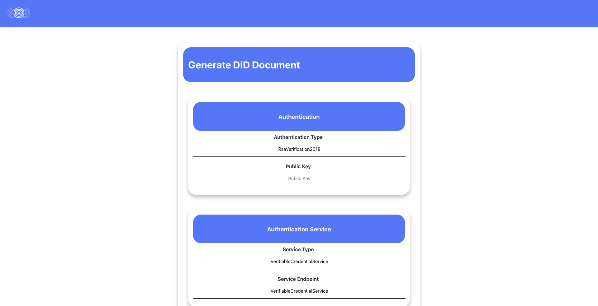

# DecentralizedID (DID) on Stratis
[](https://www.youtube.com/watch?v=Shp43zgsjQc)
## Quickstart
Deploy the smart contract by placing the bytecode below on the Stratis
dashboard.
Click on Smart Contracts > Create Contract > Paste the byte code in the
Byte Code section > Enter your Stratis wallet password > Click on create
Contract

```
Hash
280331d7cfdda1ede4a3175e23e71d8fcf00f0075d6c29513ffe9b7d65715ba6

ByteCode
4D5A90000300000004000000FFFF0000B800000000000000400000000000000000000000000000000000000000000000000000000000000000000000800000000E1FBA0E00B409CD21B8014CCD21546869732070726F6772616D2063616E6E6F742062652072756E20696E20444F53206D6F64652E0D0D0A2400000000000000504500004C01020099079CDD0000000000000000E00022200B013000000C00000002000000000000B22A0000002000000040000000000010002000000002000004000000000000000400000000000000006000000002000000000000030040850000100000100000000010000010000000000000100000000000000000000000602A00004F000000000000000000000000000000000000000000000000000000004000000C000000442A00001C0000000000000000000000000000000000000000000000000000000000000000000000000000000000000000200000080000000000000000000000082000004800000000000000000000002E74657874000000B80A000000200000000C000000020000000000000000000000000000200000602E72656C6F6300000C0000000040000000020000000E0000000000000000000000000000400000420000000000000000000000000000000000000000000000000000000000000000000000000000000000000000000000000000000000000000942A0000000000004800000002000500442200000008000001000000000000000000000000000000000000000000000000000000000000000000000000000000000000000000000000000000000000004602280600000A72010000706F0700000A2A4A02280600000A7201000070036F0800000A2A4602280600000A72270000706F0900000A2A4A02280600000A7227000070036F0A00000A2A7202280600000A7233000070038C0C000001280B00000A6F0700000A2A7602280600000A7233000070038C0C000001280B00000A046F0800000A2A7202280600000A7247000070038C0C000001280B00000A6F0C00000A2A7602280600000A7247000070038C0C000001280B00000A046F0D00000A2A860203280E00000A02166A28040000060202280F00000A6F1000000A28020000062A0000133003007A00000001000011020228030000060328080000060202280300000602280F00000A6F1000000A2806000006021200FE150300000212000228030000067D01000004120002280F00000A6F1000000A0B1201FE16070000016F1100000A7D020000041200177D0300000406280100002B0228030000060C0208176AD728040000062A0000133003007A00000002000011020203280500000602280F00000A6F1000000A281300000A725F000070281400000A0203727D000070280800000602037E1500000A2806000006021200FE15040000021200037D04000004120002280F00000A6F1000000A0B1201FE16070000016F1100000A7D050000041200167D0600000406280200002B2A000042534A4201000100000000000C00000076342E302E33303331390000000005006C00000014030000237E000080030000EC02000023537472696E6773000000006C0600008000000023555300EC060000100000002347554944000000FC0600000401000023426C6F6200000000000000020000015715A201090A000000FA013300160000010000000F00000004000000060000000B0000000B0000001500000006000000020000000100000002000000040000000100000002000000020000000200000000009E010100000000000600130117020600520117020600FF0004020F00370200000A00420169020A00870269020A00610269020A00B30069020600A900B0010A00330169020A00DA00690206000E00B00106009301B00106009502B0010A0094006902000000001500000000000100010001001000680000001900010001000A011000AB020000250001000C000A0110009C020000250004000C000600C1028D000600C70190000600760193000600C1028D000600C70190000600760193005020000000008608D001490001006220000000008108E701960001007520000000008108CA029C0002008720000000008108D402A00002009A200000000086004C00A5000300B7200000000081005A00AB000400D5200000000086003200B2000600F2200000000081003F00B70007001021000000008618FE013E00090034210000000086002800BD000A00BC210000000086001E00A0000B0000000100700100000100700100000100C10200000100C10200000200460200000100C10200000100C10200000200780000000100C70000000100780000000100C1020900FE0101001100FE0106001900FE010A002900FE0106005100FE0106003100EB00100059005302150059005E021B0059000100220059000B002700690080022D005900860133005900900138003100FE013E0031009D0044007900BC01490071007D01560031009A015A003900DE026D003100BA0275003900B7017B0021002B00FC002E000B00CB002E001300D4002E001B00F30043002300FC0081002B00FC004E006600020001000000EB01C2000000D802C7000200010003000100020003000200030005000100040005000480000000000000000000000000000000008702000004000000000000000000000084007D0000000000010002000100000000000000000069020000000003000200040002002500610025007F00000000000047657455496E7436340053657455496E743634003C4D6F64756C653E005265766F6B654449440043726561746544494400476574446174614F6644494400536574446174614F66444944004765744F776E65724F66444944005365744F776E65724F6644494400446563656E7472616C697A6564494400646174610053797374656D2E507269766174652E436F72654C696200494D657373616765006765745F4D6573736167650056616C7565547970650049536D617274436F6E7472616374537461746500736D617274436F6E74726163745374617465004950657273697374656E745374617465006765745F50657273697374656E7453746174650044656275676761626C6541747472696275746500436F6D70696C6174696F6E52656C61786174696F6E7341747472696275746500496E646578417474726962757465004465706C6F794174747269627574650052756E74696D65436F6D7061746962696C6974794174747269627574650076616C75650061637469766500546F537472696E6700476574537472696E6700536574537472696E67004C6F6700536D617274436F6E74726163742E646C6C0053797374656D005A65726F006765745F53656E646572004449444F776E6572006765745F536D617274436F6E74726163744F776E6572007365745F536D617274436F6E74726163744F776E6572002E63746F720053797374656D2E446961676E6F73746963730053797374656D2E52756E74696D652E436F6D70696C6572536572766963657300446562756767696E674D6F646573006F776E6572416464726573730047657441646472657373005365744164647265737300537472617469732E536D617274436F6E74726163747300466F726D617400536D617274436F6E7472616374004F626A656374005265766F6B654449444576656E74004372656174654449444576656E740041737365727400444944496E646578006765745F496E646578007365745F496E646578006F705F457175616C697479000000002553006D0061007200740043006F006E00740072006100630074004F0077006E0065007200000B49006E0064006500780000134F0077006E00650072003A007B0030007D00001744004900440044006100740061003A007B0030007D00001D41007300730065007200740020006600610069006C00650064002E000001000042543BE1D2570A4B97B2CD6BDC40269500042001010803200001052001011111042000122D052001111D0E062002010E111D0420010B0E052002010E0B0500020E0E1C0420010E0E052002010E0E052001011221042000123D042000111D070703110C111D0B0320000E06300101011E00040A01110C0607021110111D07000202111D111D05200201020E0306111D040A011110087CEC85D7BEA7798E02060B02060E02060205200101111D0320000B042001010B052001111D0B062002010B111D0420010E0B052002010B0E042001010E042800111D0328000B0801000800000000001E01000100540216577261704E6F6E457863657074696F6E5468726F777301080100020000000000040100000000000000000000000000000000000010000000000000000000000000000000882A00000000000000000000A22A0000002000000000000000000000000000000000000000000000942A0000000000000000000000005F436F72446C6C4D61696E006D73636F7265652E646C6C0000000000FF250020001000000000000000000000000000000000000000000000000000000000000000000000000000000000000000000000000000000000000000000000000000000000000000000000000000000000000000000000000000000000000000000000000000000000000000000000000000000000000000000000000000000000000000000000000000000000000000000000000000000000000000000000000000000000000000000000000000000000000000000000000000000000000000000000000000000000000000000000000000000000000000000000000000000000000000000000000000000000000000000000000000000000000000000000000000000000000000000000000000000000000000000000000000000000000000000000000000000000000000000000000000000000000000000000000000000000000000000000000000000000002000000C000000B43A00000000000000000000000000000000000000000000000000000000000000000000000000000000000000000000000000000000000000000000000000000000000000000000000000000000000000000000000000000000000000000000000000000000000000000000000000000000000000000000000000000000000000000000000000000000000000000000000000000000000000000000000000000000000000000000000000000000000000000000000000000000000000000000000000000000000000000000000000000000000000000000000000000000000000000000000000000000000000000000000000000000000000000000000000000000000000000000000000000000000000000000000000000000000000000000000000000000000000000000000000000000000000000000000000000000000000000000000000000000000000000000000000000000000000000000000000000000000000000000000000000000000000000000000000000000000000000000000000000000000000000000000000000000000000000000000000000000000000000000000000000000000000000000000000000000000000000000000000000000000000000000000000000000000000000000000000000000000000000000000000000000000000000000000000000000000000000000
```

To test out the smart contract you will have to rely largely on the Swagger API. 
I was not able to set up a web-based frontend UI on React due to CORS problems. 

To generate DID documents, access `/frontend` and run `yarn start`

## Problem and Motivations
Identity management systems are largely dependent on centralized
authorities like domain name registries, government authorities,
certificate authorities, etc. These centralized authorities act
as roots of trust; however, they are single point of failures.
A better approach in the long run is to to rely on decentralized
identity systems where shared roots of trusts are used, thus
preventing single points of failure, increasing reliability, trust,
and transparency regarding identity. Decentralized identity gives the
individual control over one's identity instead of relinquishing control
over to a centralized authority.

## Solution
The first challenge we face is defining identity. Identity is built upon
a number of indicators:

1. Your physical attributes; for example, retina scans,
fingerprints, etc. These traits are used in biometrics to
ascertain identity

2. Entities that attest to your identity; for example, passport and id
cards issued by governments, etc.

3. Things that you have accumulated, achieved, and done throughout your
life; for example, awards, certifications, social media data.


All of these indicators can be decomposed into data and can be
either linked or stored in an identity document. Each of the document
may possess some marginal probability of failure. Increasing the number
of such documents tied to identity would increase the reliability of one's
decentralized identity.


In order to implement this the decentralized identity mechanism
we will using recommendations and specifications from
[https://w3c.github.io/did-core/](https://w3c.github.io/did-core/).
We will adopt the decentralized identifier scheme as mentioned in the protocol
```
--- FORMAT ---

scheme:method:method-specific identifier

--- WHAT WE USE ---
did:stratis:<Some ID generated by the smart contract>
```

What Stratis and blockchains allow us to do is to create a registry of DIDs.

We note that that StratisIdentity has addressed Identity on Stratis, this project hopes to provide a bridge for w3 specifications from https://www.w3.org/TR/did-core/. 

## Smart Contract Methods
1. Create Identity Documents `/api/contract/CZtwKAMnz7UW9ADaFcC3im2YUBEN77TpU1/method/CreateDID`

1. Revoking Identity Documents `/api/contract/CZtwKAMnz7UW9ADaFcC3im2YUBEN77TpU1/method/RevokeDID`
(Note: To update simply revoke and create a new document)

1. Get Owner Of Identity Document `/api/contract/CZtwKAMnz7UW9ADaFcC3im2YUBEN77TpU1/method/GetOwnerOfDID`

1. Get Data Of Identity Document `/api/contract/CZtwKAMnz7UW9ADaFcC3im2YUBEN77TpU1/method/GetDataOfDID`


## Attack Vector Analysis
### Impersonation Attacks
There are a few notable channels that can enable impersonation attacks to
occur. One is Social Media (should it be used as a identity document), and
people copying projects and seeding payments.

#### Social Media
Social Media may be an unreliable source of data but it is easy to use and
integrate as an identity document. As such, it is a useful channel to
bootstrap the adoption such a system. An possible identity document is
placing your Stratis wallet address in the description on your bio and
placing the link in the identity document. An attacker can copy one's
social media profile and place a different wallet address on the bio.


It is unlikely that the attacker's copied profile would possess
the exact same signature as the original account in a short period of
time. In the case of Twitter, it is unlikely that the copied posts would
have the same people liking and retweeting. Copied posts would have
a different timestamp as attackers are unlikely to copy posts
instantaneously. This gives the person controlling the original profile
a reasonably long enough timeframe to report the attacker's profile or
announce on their own social profiles that the attacker's account is a
fraud.  

### Failure Of Links
Suppose we used a link in the identity document and the link dies. The
identity document becomes invalid. We recognize that it is possible that
each document might fail. If the document has a 100% chance of failure it
is invalid as a identity document in the first place and cannot be used.
However, the probability likely ranges between a non-negligible % to 100%.
As such, an effective counter measure is to simply increase the number of
partially reliable identity documents pertaining to one's identity. 


## Requests for Comments and Contributions
The current implementation for the Stratis Hackathon is likely incomplete
or missing key features. Feel free to submit issues or pull requests.

## Further Works
1. Monitoring progress with W3C's DID specification and adopting any new changes. 
1. Building towards a cross-chain Decentralized Identity system, such that 
Decentralized Identity Documents may be shared across various blockchains increasing 
robustness even further.

## Screenshots
