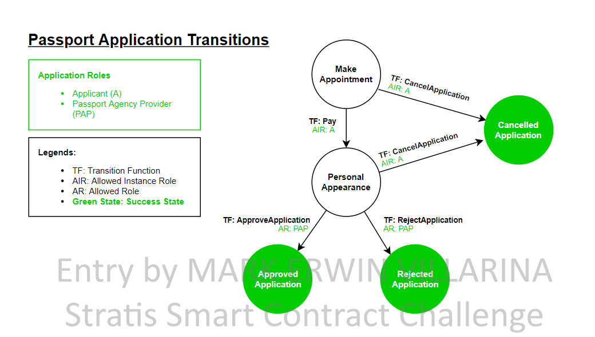

Passport Application Smart Contract
==============================

Overview 
---------

The Passport Application Smart Contract expresses a workflow for applying/renewing of passport that suppports online payment. The state transition diagram below shows the interactions among the states in this workflow. 

Application Roles 
------------------

| Name                   | Description                                       |
|------------------------|---------------------------------------------------|
| Provider 				 | A government organization that responsible for issuance of the passport |
| Applicant    			 | The individual whom needs a passport |

States 
-------

| Name                   | Description                                       |
|------------------------|---------------------------------------------------|
|MakeAppointment 		 | Indicates that the applicant did make an appointment for passport application/renewal |
|PersonalAppearance 	 | Indicates that the applicant should visit the passport agency office for personal appearance.|
|CancelledApplication 	 | Indicates that the applicant have cancelled his/her application.|
|ApprovedApplication 	 | Indicates that the applicant passport application has been approved by the provider |
|RejectedApplication 	 | Indicates that the applicant passport application has been rejected by the provider |

Workflow Details
----------------

An instance of the Passport Application Smart Contract's workflow starts in the:

<b>MakeAppointment</b> state when an applicant successfully select an appointment schedule and filled up an online application form. 

The state changes to <b>PersonalAppearance</b> when the applicant paid the application fee. The application fee is currently set to <b>80 CRS</b>. The smart contract will hold the payment until the state set either to <b>ApprovedApplication</b>, <b>RejectedApplication</b>, or <b>CancelledApplication</b> state.

The applicant have a chance to cancel his/her appointment when the current state is <b>MakeAppointment</b> or <b>PersonalAppearance</b> but there is a penalty of <b>8 CRS</b>. After cancelling an appointment,  the applicant will only receive <b>72 CRS</b>, the provider will receive the <b>8 CRS</b> and the state will be set to <b>CancelledApplication</b> state.

When the current state is in <b>PersonalAppearance</b>, the provider/passport government agency could approve the applicant's application. If the provider approves the application, the smart contract will transfer the payment (80 CRS) to provider's address. The state will set to <b>ApprovedApplication</b> state and the process is completed.

Also, when the current state is in <b>PersonalAppearance</b>, the provider/passport government agency could reject the applicant's application. If the provider rejects the application, the smart contract will transfer 8 CRS as processing fee to provider's address and 72 CRS to applicant's address. The state will set to <b>RejectedApplication</b> state and the process is completed.

Application Files
-----------------
1. Smart Contract: [PassportApplication.cs](./PassportApplicationContract/PassportApplication.cs)
2. Smart Contract Test Case: [PassportApplicationTests.cs](./PassportApplicationContract.Tests/PassportApplicationTests.cs)
