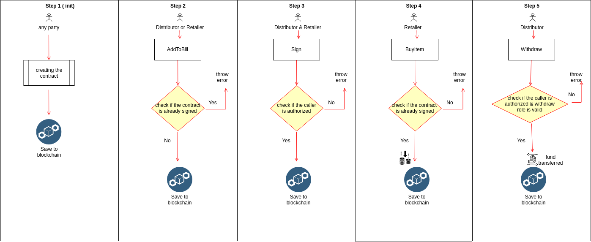

TrustMe Smart Contracts
====================================================
Overview 
---------
TrustMe Smart contract scenario shows an example of how  two parties (retailer and distributor ) can digitize their paper contract and increase the trust by forcing the role they have agreed on through blockchain so that distributor can take his money once the percentage of sold product has been reached. also the paper contract is guarded through blockchain as it holds the hash of the contract after signing so any attempt to fraudulent altering can be easily detected .   
	
Contracts 
------------------
- AgreementContract

Application Roles 
------------------

| Name       | Description                                                                                         |
|------------|-----------------------------------------------------------------------------------------------------|
| Distributor| A person Who provides the product items for Retailer and in turn he get the money.
| Retailer      | A person Who take the product items fom Distributor and in turn he pay the money.                                   |

AgreementContract Workflow States 
-------

| Name                 | Description                                                                                                 |
|----------------------|-------------------------------------------------------------------------------------------------------------|
| Inventory               | when the product item hasn't been sold yet.                               |
| Sold         | Indicates that  the product item has  been sold .                                                                       |

 

Workflow Details
----------------

- step 1 : when the contract is created . contract creation requires passing the address of distributor , retailer , issue date as well as withdraw role ( this to indicate the percentage where the distributor can withdraw his funds)
- step 2 : when any party starts to add all the item that will be sold and will be included in the paper contract 
- step 3 : Both parties need to sign to agree on the contract by passing the hash of the paper contract digitally signed. 
- step 4 :  where retailer starts to  buy the item . 
- step 5 :  where distributor starts to  collect his money as long as the retailer bought the percentage they had agreed on.

Application Files
-----------------

[SupplyChain.cs](SupplyChain.cs) - This file contains the code for the  AgreementContract .

